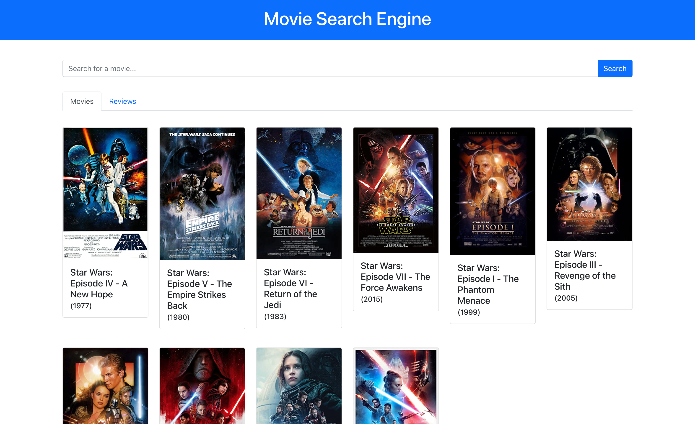

# Movie Search Engine

This is a web application that uses ReactJS for the front-end and NodeJS for the back-end. Users can find and learn more about movies they are interested in through their descriptions or reviews.

# Web Services

The application invokes three web services: omdb API, NYT reviews API, and the country information SOAP service. Omdb API is a free REST service that has information about movies. I used this service to get a list of movies based on a query for titles. When the user clicks on a movie, it makes another call to get more detailed information about each movie based on a unique ID that is assigned to each movie. Subsequently, it invokes the SOAP service to get pictures of country flags by passing in one or more countries to the back-end. Upon succesful request to the back-end, it calls two SOAP methods: CountryISOCode and CountryFlag. The former method converts a given country name into an country ISO code such as 'US'. This result gets passed into the latter method which only accepts country ISO codes. Finally, the response is sent back to the front-end in the form of at least one image url. For the NYT movie reviews API, it makes queries based on movie titles through a GET request. Then it returns a list of NYT reviews and other related information such as author, title, etc. 

# Home Screen UI

The user types in a movie name they want to search for and presses enter. Then it will return a list of movies with their titles and release dates. There are two tabs for movies and the New York Times movie reviews. The user can switch between two different views by clicking on the "Movies" and "Reviews" tabs.

# Movie Details UI

A user can click on a movie in the "Movies" view. This will reveal more detailed information about that movie such as plot, rating, genres, and countries.

# Movie Reviews UI

A user can also click on the "Reviews" tab to see a list of NYT movie reviews. Each review card contain the article titles, movie titles, author, last updated, and a short summary of the article. The cards can be clicked on for the full NYT movie review.

# Project setup

Dependencies for the client and server need to be installed separately:

### `npm install`
### `cd client && npm install`

# Project start

The client and server both need to be running for the application to work properly:

### `npm start`
### `cd client && npm start`

